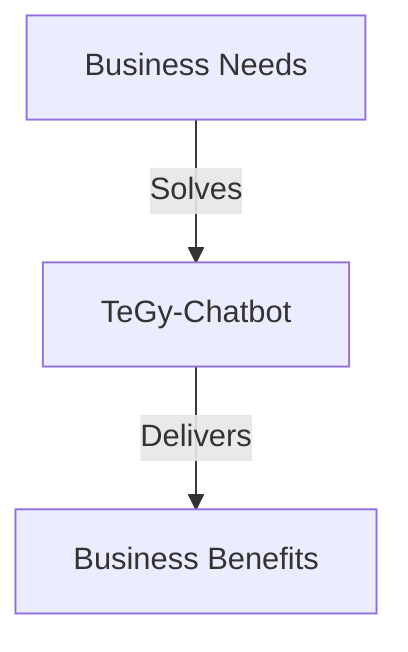
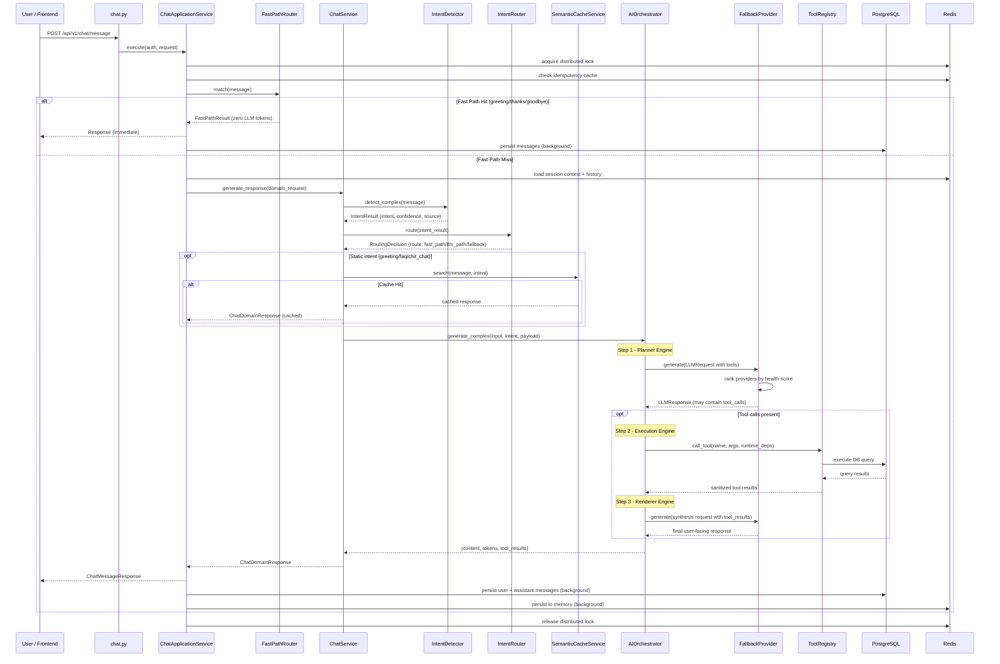
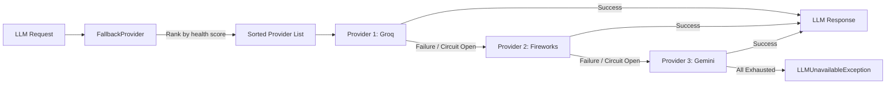
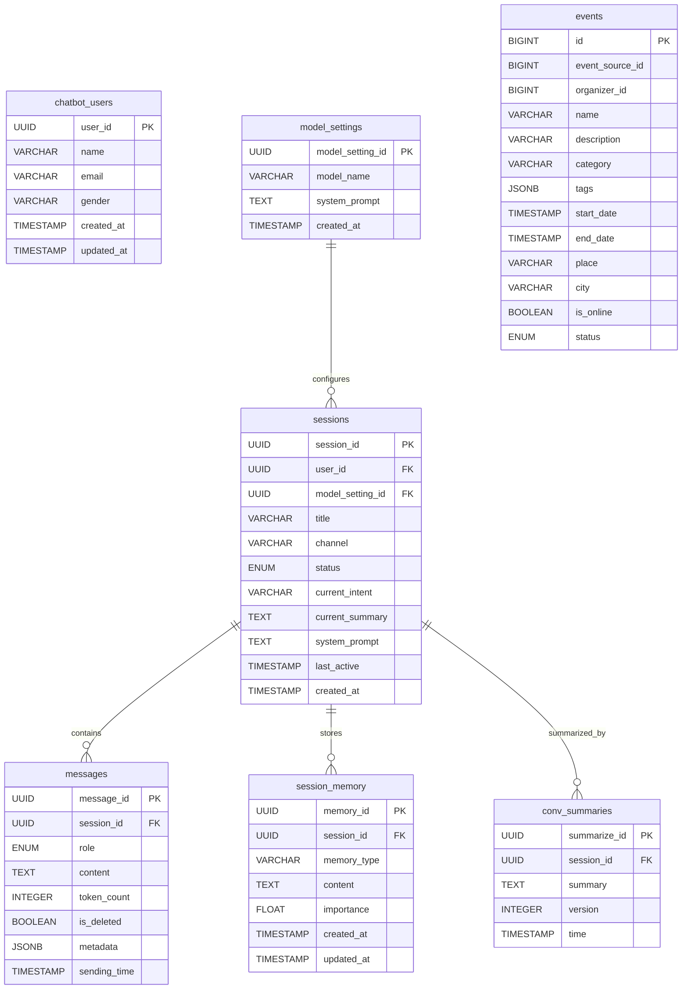
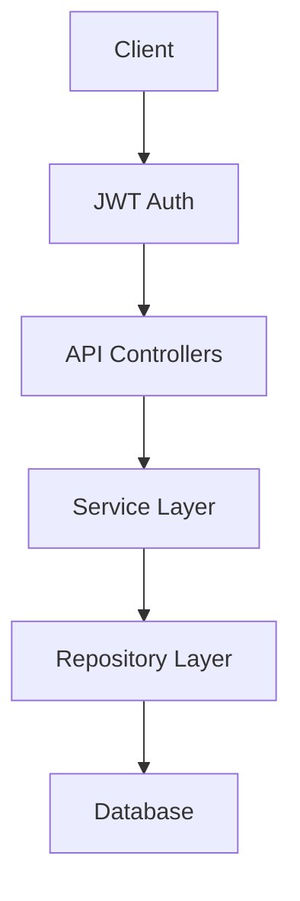
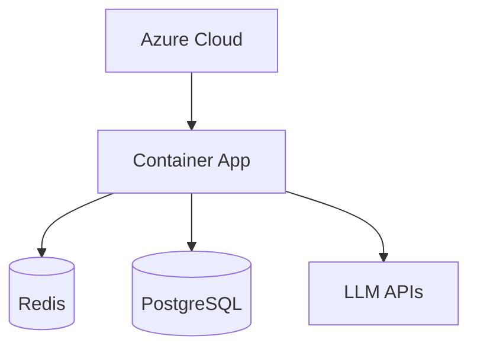

# TeGy-Chatbot: AI-Powered Conversational Backend for Event Ticket Booking

---

## 1. Introduction and Motivation

The proliferation of online event ticketing platforms has introduced a new class of user-experience challenges. Users frequently encounter friction when searching for events, comparing ticket prices, understanding venue logistics, or completing multi-step booking flows. Traditional FAQ pages and static help centers fail to address these needs in a personalized, context-aware manner.

This project, **TeGy-Chatbot**, addresses these challenges by providing an AI-powered conversational backend system that is integrated into an existing ticket and event booking website. The chatbot acts as an intelligent assistant capable of understanding natural-language user queries—in both Arabic and English—and responding with contextually relevant information, event recommendations, and guided booking workflows.

The system is implemented as a standalone backend service built with the Python FastAPI framework, designed to be consumed by a separate frontend client via RESTful API endpoints. Its architecture emphasizes fault tolerance through multi-provider LLM integration, low-latency responses through semantic caching and a zero-LLM fast-path router, and operational resilience through distributed circuit breakers and background job processing.

## 2. Project Objectives

The primary objectives of this project are:

1. **Event Discovery**: Enable users to find events matching their interests through natural language queries, powered by semantic search and database retrieval (`app/ai/tools/event_tools.py`).
2. **Intelligent Q&A**: Answer user questions about event dates, ticket prices, venues, and booking status using LLM-generated responses grounded in real database records.
3. **Booking Management**: Guide users step-by-step through ticket booking and allow retrieval or cancellation of existing bookings (`app/ai/tools/ticket_tools.py`, `app/ai/tools/order_tools.py`).
4. **Multi-Language Support**: Handle conversations in both Arabic and English, with Arabic-first branded responses for social interactions (`app/ai/fast_path_router.py`).
5. **Production-Grade Reliability**: Ensure continuous availability through multi-provider LLM failover, distributed locking, idempotency guarantees, and graceful degradation when external services are unavailable.

## 3. System Overview

TeGy-Chatbot is a modular, layered backend application. At the time of writing, the audited version of the repository consists of approximately 60 Python source files organized across 11 primary packages. The system integrates three external LLM providers (Groq, Fireworks, Gemini), two databases (PostgreSQL and Redis), a background job queue (ARQ), and a semantic vector search engine (FAISS with SentenceTransformers). At the time of the audit, it exposes 14 REST API endpoints across three route groups: Chat, Sessions, and System Health.

The codebase follows a strict separation of concerns: API controllers are thin delegators, business logic resides in the service layer, data access is abstracted through the repository pattern, and AI orchestration is encapsulated in a dedicated module with its own provider abstraction, intent routing, tool calling, and safety validation subsystems.

## 4. Business Value and Client Benefits

The following diagram illustrates the high-level business flow:



The following table presents the key features of TeGy-Chatbot from a business perspective, mapping each feature to its tangible benefit and the evidence of its implementation within the repository.

| Feature | Business Benefit | Evidence |
|---|---|---|
| 24/7 Automated Customer Support | Reduces the need for human support agents by handling common queries (event info, booking status) autonomously. | `app/ai/intent_detector.py`: classifies intents including `support_billing`, `support_technical`, `support_event` |
| Multi-Provider LLM Failover | Ensures chatbot availability even when a single AI provider experiences downtime or rate limiting. | `app/ai/providers/factory.py`: `PRIORITY_LIST = ["groq", "fireworks", "gemini"]` |
| Zero-LLM Fast Path for Social Intents | Reduces AI API costs by handling greetings, thanks, and goodbyes with zero LLM calls (saving ~1,400 tokens per interaction). | `app/ai/fast_path_router.py`: `_PLANNER_AVG_TOKENS = 800`, `_RENDERER_AVG_TOKENS = 600` |
| Semantic Caching | Avoids redundant LLM calls for semantically similar questions, reducing latency and API costs. | `app/services/semantic_cache_service.py`: Implemented in pp/services/semantic_cache_service.py |
| Automated Conversation Summarization | Reduces token consumption for long conversations by summarizing older messages in the background. | `app/workers/summarization_worker.py`, triggered every 10 messages (`app/ai/memory_manager.py`) |
| Guided Booking via Tool Calling | Reduces booking abandonment and human error by allowing the AI to execute database operations (search events, create tickets) on behalf of the user. | `app/ai/tools/event_tools.py`, `app/ai/tools/ticket_tools.py` |
| Idempotency and Distributed Locking | Prevents duplicate bookings and ensures data consistency under concurrent requests. | `app/services/idempotency_service.py`, `app/infrastructure/adapters/redis_lock_adapter.py` |

> **Note**: Cost savings and efficiency gains are stated in qualitative terms. No specific monetary figures or percentage improvements are asserted, as no benchmarking data was found in the repository.

## 5. System Architecture

The system follows an N-tier layered architecture with strict unidirectional data flow. The following diagram illustrates the major components and their interactions, with each box corresponding to a verified module in the codebase.

```mermaid
graph TD
    User["User (Frontend Client)"]

    subgraph API_Layer["API Layer (app/api/v1/routes/)"]
        ChatRoute["chat.py"]
        SessionRoute["sessions.py"]
        HealthRoute["health.py"]
    end

    subgraph Service_Layer["Service Layer (app/services/)"]
        CAS["ChatApplicationService"]
        CS["ChatService"]
        SS["SessionService"]
    end

    subgraph AI_Layer["AI Layer (app/ai/)"]
        FPR["FastPathRouter"]
        ID["IntentDetector"]
        IR["IntentRouter"]
        PB["PromptBuilder"]
        AIO["AIOrchestrator"]
        RG["ResponseGenerator"]
        TR["ToolRegistry"]
        SC["SemanticCacheService"]
    end

    subgraph Provider_Layer["LLM Providers (app/ai/providers/)"]
        FP["FallbackProvider"]
        Groq["GroqProvider"]
        FW["FireworksProvider"]
        Gemini["GeminiProvider"]
    end

    subgraph Data_Layer["Data Layer"]
        PG[("PostgreSQL")]
        Redis[("Redis")]
    end

    subgraph Workers["Background Workers (app/workers/)"]
        ARQ["ARQ Worker"]
        SumJob["summarize_session_job"]
    end

    User -->|HTTP POST /api/v1/chat/message| ChatRoute
    User -->|HTTP GET/DELETE/PATCH| SessionRoute
    ChatRoute --> CAS
    SessionRoute --> SS
    CAS -->|"Fast Path Check"| FPR
    CAS -->|"Normal Path"| CS
    CS --> ID
    CS --> IR
    CS --> SC
    CS --> AIO
    AIO --> PB
    AIO --> RG
    AIO --> TR
    RG --> FP
    FP --> Groq
    FP --> FW
    FP --> Gemini
    TR -->|"Tool Execution"| PG
    CAS --> Redis
    SS --> PG
    SS --> Redis
    ARQ --> SumJob
    SumJob --> PG
    SumJob --> RG
    Redis -.->|"Queue"| ARQ
```



## 6. Message Flow and Request Lifecycle

When a user sends a message via `POST /api/v1/chat/message`, the request traverses a multi-phase pipeline within `ChatApplicationService.execute()` (`app/services/chat_application_service.py`). The following sequence diagram traces the complete lifecycle.



### Pipeline Phases

The pipeline within `ChatApplicationService.execute()` operates in three sequential phases:

**Phase 1 — Context Resolution**: The system resolves the user identity from the JWT token, synchronizes the user profile, creates or retrieves the chat session, and loads conversation history from Redis.

**Phase 2 — AI Generation**: The `ChatService.generate_response()` method is invoked with a configurable timeout (`AI_REQUEST_TIMEOUT = 45` seconds, from `app/core/config.py`). This phase encompasses intent detection, routing, semantic cache lookup, and the three-engine orchestrator pipeline (Planner → Execution → Renderer).

**Phase 3 — Persistence**: User and assistant messages are persisted to PostgreSQL and Redis memory. On the success path, persistence is executed in a background task to minimize response latency, with the distributed lock transferred to the background task to guarantee strict message ordering.

## 7. AI and LLM Integration

### 7.1 Provider Architecture

The system integrates three LLM providers, each implemented as a subclass of the abstract `LLMProvider` base class (`app/ai/providers/base.py`). Providers are automatically discovered at startup via the `ProviderRegistry` (`app/ai/providers/registry.py`) and instantiated by the `ProviderFactory` (`app/ai/providers/factory.py`).

| Provider | Model | Role | Fallback Order | Timeout | Source File |
|---|---|---|---|---|---|
| Groq | `llama-3.3-70b-versatile` | Primary (lowest latency) | 1st | 30s | `app/ai/providers/groq_provider.py` |
| Fireworks | `qwen-v2p5-14b-instruct` | Secondary fallback | 2nd | 30s | `app/ai/providers/fireworks_provider.py` |
| Gemini | `gemini-3-flash-preview` | Tertiary fallback | 3rd | 30s | `app/ai/providers/gemini_provider.py` |

The fallback order is defined in `app/ai/providers/factory.py`:

```python
# app/ai/providers/factory.py
PRIORITY_LIST = ["groq", "fireworks", "gemini"]
```

### 7.2 Fallback Mechanism

To ensure high availability and prevent single-point-of-failure scenarios when relying on external AI services, the system employs a robust fallback strategy. When multiple providers are configured, the factory wraps them in a `FallbackProvider` (`app/ai/providers/fallback_provider.py`). This provider implements health-based dynamic selection: providers are ranked by a real-time health score computed from their success rate (60% weight) and average latency (40% weight), modulated by circuit breaker state.



The following snippet shows the core fallback iteration from `app/ai/providers/fallback_provider.py`:

```python
# app/ai/providers/fallback_provider.py
ranked_providers = sorted(
    self.providers,
    key=lambda p: (
        p.metrics.calculate_health_score(p.circuit)
        if hasattr(p, "metrics") and hasattr(p, "circuit")
        else 0.5
    ),
    reverse=True
)

for provider in ranked_providers:
    circuit = getattr(provider, "circuit", None)
    if circuit and not circuit.is_available():
        reason = f"OPEN (Reason: {circuit.failure_reason})"
        skipped_info.append(f"{provider.provider_name}: {reason}")
        continue
    # ... attempt generation
```

### 7.3 Resilience: Circuit Breaker and Retry

Network instability and API rate limits are common challenges when integrating third-party AI models. To protect the application from cascading failures and excessive latency, each provider is equipped with an independent circuit breaker and retry mechanism, both implemented in `app/ai/providers/resilience.py`.

- **Circuit Breaker** (`ProviderCircuitBreaker`): Transitions through three states — CLOSED → OPEN (after 5 consecutive failures) → HALF_OPEN (after 30-second cooldown) → CLOSED (on first success). These thresholds are configurable via `CIRCUIT_BREAKER_THRESHOLD` and `CIRCUIT_BREAKER_COOLDOWN_SECONDS` in `app/core/config.py`.
- **Retry with Exponential Backoff** (`retry_with_backoff`): Retries transient and timeout errors up to `LLM_MAX_RETRIES = 2` times with a base delay of 0.5 seconds (from `app/core/config.py`).

### 7.4 Intent Detection and Routing

Accurately understanding the user's goal is the first critical step in a conversational pipeline. Rather than routing all messages to an expensive LLM immediately, the intent detection system follows a hybrid approach implemented in `IntentDetector` (`app/ai/intent_detector.py`):

1. **Rule-Based Detection**: A fast, zero-cost first pass using keyword matching against predefined categories (`billing`, `technical`, `event`, `booking`, `greeting`). Each match yields a confidence score between 0.0 and 1.0.
2. **LLM Fallback**: When rule-based confidence falls below 0.6 or the intent is classified as `general`, the system falls back to the LLM for classification, costing tokens but providing higher accuracy.

The `IntentRouter` (`app/ai/intent_router.py`) translates the classified intent into a routing decision:
- **`fast_path`**: For `greeting` and `booking` intents with high confidence (≥0.8). Greeting goes directly to `FastPathRouter`; booking falls through to the full LLM pipeline.
- **`llm_path`**: Default route for most intents.
- **`fallback_path`**: For very low confidence results (<0.5).

### 7.5 Three-Engine Orchestrator Pipeline

Handling complex multi-step tasks, such as searching for events and executing bookings, requires a structured reasoning and execution approach. To manage this safely and reliably, the `AIOrchestrator` (`app/services/ai_orchestrator.py`) implements a three-step pipeline for complex requests:

1. **Planner Engine**: Sends the user message to the LLM with available tools attached. The LLM decides whether to call tools or respond directly. If a tool hint is mapped to the intent (via `INTENT_TOOL_MAP`) and the LLM fails to call it, the planner retries with forced tool choice up to 2 times.
2. **Execution Engine**: Executes the tool calls returned by the planner via `ToolRegistry.call_tool()`, passing runtime database sessions as dependencies. Tool outputs are sanitized through a two-layer semantic firewall that strips forbidden keys (`instruction`, `command`, `execute`, etc.) and detects prompt injection patterns.
3. **Renderer Engine**: A "blind renderer" that receives only the tool results and conversation context—never the raw tool definitions—to synthesize a user-facing response. This separation prevents the renderer from hallucinating tool calls.

### 7.6 Fast Path Router

To minimize unnecessary LLM usage and guarantee instant responses for common interactions, the system introduces a lightweight routing layer. The `FastPathRouter` (`app/ai/fast_path_router.py`) intercepts social/meta intents (greeting, identity, thanks, goodbye) using compiled regex patterns and returns predefined branded responses in Arabic without any LLM calls. This optimization saves approximately 1,400 tokens per matched interaction.

### 7.7 Tool Calling

The AI can invoke database-connected functions via the `ToolRegistry` (`app/ai/tool_registry.py`). Tools are auto-discovered at startup by scanning `app/ai/tools/` for modules with `@ToolRegistry.register_tool` decorators (`app/ai/tools/__init__.py`). The system currently registers three tools:

| Tool Name | File | Purpose |
|---|---|---|
| `search_events` | `app/ai/tools/event_tools.py` | Searches events via semantic search API + database lookup |
| `create_ticket` | `app/ai/tools/ticket_tools.py` | Creates a ticket booking for a given event |
| `search_orders` | `app/ai/tools/order_tools.py` | Retrieves past user orders |

The orchestrator dynamically filters which tools are available based on the detected intent (`app/services/ai_orchestrator.py`). For example, booking intents only receive `check_availability`, `create_booking`, and `get_user_profile` tools.

### 7.8 Semantic Cache

To further reduce latency and API costs for frequently asked questions, the system leverages vector-based caching for semantic similarity rather than exact text matching. The `SemanticCacheService` (`app/services/semantic_cache_service.py`) provides an in-memory vector cache using FAISS (`faiss-cpu==1.10.0`) and SentenceTransformers (`sentence-transformers==3.4.1` with the `all-MiniLM-L6-v2` model, 384-dimensional embeddings). It is used exclusively for static intents (`greeting`, `general_faq`, `chit_chat`, `fallback`) as defined in `app/services/chat_service.py`. The cache has a similarity threshold of 0.88, a TTL of 7 days, and a maximum capacity of 5,000 entries with FIFO eviction (from `app/core/config.py`, and `app/services/semantic_cache_service.py`).

## 8. Database Design

The system uses two separate PostgreSQL databases, both accessed asynchronously via SQLAlchemy 2.0 with the `asyncpg` driver.

- **Chatbot Database** (`app/db/chatbot_database.py`): Stores all chatbot-specific state—sessions, messages, user profiles, memory, summaries, and model settings.
- **Main Database** (`app/db/main_database.py`): The primary application database containing events, bookings, and user accounts. The chatbot reads from this database via tools but does not write to it.

Redis serves as a high-speed operational store for session context, recent message history (last 20 messages), message counters, distributed locks, and the ARQ job queue.

### 8.1 Entity-Relationship Diagram

The following ER diagram represents the chatbot database schema as defined by the SQLAlchemy ORM models in `app/models/`.



### 8.2 Database Normalization

The database schema adheres to Third Normal Form (3NF) to eliminate data redundancy and ensure data integrity. By separating the entities:
- **`chatbot_users`**: Stores core user identity independently of sessions.
- **`sessions`**: Represents conversational contexts without duplicating user details.
- **`messages`, `session_memory`, `conv_summaries`**: Each manages a specific aspect of the conversation, allowing the system to scale message storage, retrieve summaries, and manage memories without altering the core session record.

This separation of concerns ensures that the database structure remains optimal for high read/write operations characteristic of conversational interfaces.

### 8.3 Redis Data Schema

Redis keys follow a versioned naming convention managed by the `RedisKeys` class (`app/db/redis.py`):

| Key Pattern | Data Type | TTL | Purpose |
|---|---|---|---|
| `v1:session:{id}:context` | Hash | 7 days | Session metadata (user_id, intent, summary, model) |
| `v1:session:{id}:messages` | List | 24 hours | Last 20 messages (LIFO, trimmed) |
| `v1:session:{id}:msg_count` | String (counter) | 24 hours | Message counter for summarization trigger |
| `v1:session:{id}:summarizing` | String (lock) | 5 minutes | Distributed lock for summarization |

These TTL values are defined in `app/ai/memory_manager.py`.

## 9. Design Patterns

The following design patterns were identified and verified in the codebase:

| Pattern | Evidence File(s) | Purpose |
|---|---|---|
| **Repository Pattern** | `app/repositories/base_repo.py` (generic CRUD), `session_repo.py`, `message_repo.py`, `chatbot_user_repo.py`, `summary_repo.py`, `memory_repo.py`, `model_settings_repo.py` | Abstracts database access behind a uniform interface, enabling service-layer testability without database dependencies. |
| **Factory Pattern** | `app/ai/providers/factory.py` (`ProviderFactory.initialize_provider_chain()`) | Encapsulates provider instantiation logic, including configuration validation and priority-based chain assembly. |
| **Strategy Pattern** | `app/ai/providers/base.py` (`LLMProvider` abstract class), with concrete strategies in `groq_provider.py`, `fireworks_provider.py`, `gemini_provider.py` | Allows interchangeable LLM providers behind a common interface, enabling runtime selection and fallback. |
| **Chain of Responsibility** | `app/ai/providers/fallback_provider.py` | Cascades requests through a ranked chain of providers, each handling or forwarding based on availability and health. |
| **Dependency Injection / IoC Container** | `app/core/container.py` (`ServiceContainer`) | Centralizes the entire dependency graph construction; services are never self-constructed. Routes delegate to `ServiceContainer.build_*()` methods. |
| **Decorator-Based Registration** | `app/ai/tool_registry.py` (`@ToolRegistry.register_tool`), `app/ai/providers/registry.py` (`@register_provider`) | Enables plug-and-play auto-discovery of tools and providers without manual registration lists. |
| **Adapter Pattern** | `app/infrastructure/adapters/redis_lock_adapter.py`, `redis_state_adapter.py`, `redis_resilience_adapter.py`, `ai_token_adapter.py` | Bridges infrastructure concerns (Redis, token counting) to abstract ports defined in `app/core/ports/`, isolating the service layer from infrastructure details. |
| **Template Method** | `app/services/ai_orchestrator.py` (`_execute_llm_path` calling `_plan_step` → `_execute_step` → `_render_step`) | Defines a fixed algorithm skeleton (Plan → Execute → Render) with overridable steps. |

The following snippet illustrates the Dependency Injection pattern in `app/core/container.py`:

```python
# app/core/container.py
@staticmethod
async def build_chat_application_service(
    request: Request, db: AsyncSession, main_db: AsyncSession,
) -> ChatApplicationService:
    redis = await get_redis()
    message_repo = MessageRepository(db)
    session_service = ServiceContainer._build_session_service(db, message_repo, redis)
    state_port = RedisStateAdapter(redis)
    lock_port = RedisLockAdapter(redis)
    resilience_port = RedisResilienceAdapter(redis)
    token_port = LLMTokenAdapter(
        counter=request.app.state.response_generator.count_tokens
    )
    # ... assembles ChatApplicationService with all dependencies
```

## 10. Background Job Processing

The system uses **ARQ** (`arq==0.26.3`), a Redis-based asynchronous task queue, for background job processing. The worker configuration is defined in `app/workers/arq_jobs.py`:

```python
# app/workers/arq_jobs.py
class WorkerSettings:
    redis_settings = get_arq_redis_settings()
    functions = [summarize_session_job]
    queue_name = settings.ARQ_QUEUE_NAME  # "chatbot-jobs"
    max_jobs = 10
    job_timeout = settings.ARQ_JOB_TIMEOUT_SECONDS  # 120 seconds
    on_startup = startup
    on_shutdown = shutdown
```

The primary background job is `summarize_session_job` (`app/workers/arq_jobs.py`), which delegates to `run_summarization_job` (`app/workers/summarization_worker.py`). This job is triggered when the message counter for a session reaches a multiple of 10 (`SUMMARIZE_EVERY = 10`, from `app/ai/memory_manager.py`). The summarization worker:

1. Acquires a distributed lock to prevent duplicate summarization.
2. Performs a Redis bucket-lock re-verification and a database-level idempotency guard.
3. Fetches the last 30 messages from PostgreSQL (source of truth, not Redis).
4. Calls the LLM to generate a summary via the `Summarizer` class.
5. Persists the summary to the `conv_summaries` table with a version number.
6. Atomically decrements the message counter to preserve counts for messages that arrived during processing.

Failed jobs are retried with exponential backoff up to `ARQ_MAX_RETRIES = 3` times (`app/core/config.py`).

## 11. API Design

The API follows RESTful conventions with versioned routing under `/api/v1/`. All endpoints are defined in `app/api/v1/routes/` and registered in `app/main.py`. Authentication is handled via JWT tokens (`PyJWT==2.12.1`) and an API-key mechanism for integration clients (`app/core/api_key_auth.py`).

### 11.1 Endpoint Reference

| Method | Path | Purpose | Source File |
|---|---|---|---|
| `POST` | `/api/v1/chat/message` | Send a chat message and receive AI response | `app/api/v1/routes/chat.py` |
| `POST` | `/api/v1/chat/session` | Create a new chat session | `app/api/v1/routes/chat.py` |
| `GET` | `/api/v1/chat/history/{session_id}` | Retrieve paginated message history | `app/api/v1/routes/chat.py` |
| `GET` | `/api/v1/sessions` | List user sessions (paginated) | `app/api/v1/routes/sessions.py` |
| `DELETE` | `/api/v1/sessions/{session_id}` | Delete a session | `app/api/v1/routes/sessions.py` |
| `PATCH` | `/api/v1/sessions/{session_id}` | Update session metadata | `app/api/v1/routes/sessions.py` |
| `GET` | `/api/v1/health` | System health check (DB, Redis, Queue) | `app/api/v1/routes/health.py` |
| `GET` | `/api/v1/health/cache/status` | Cache statistics | `app/api/v1/routes/health.py` |
| `GET` | `/api/v1/health/cache/health` | Cache health check | `app/api/v1/routes/health.py` |
| `POST` | `/api/v1/health/cache/clear/sessions` | Clear session cache | `app/api/v1/routes/health.py` |
| `POST` | `/api/v1/health/cache/clear/prompts` | Clear prompt cache | `app/api/v1/routes/health.py` |
| `POST` | `/api/v1/health/cache/warm` | Pre-load caches | `app/api/v1/routes/health.py` |
| `POST` | `/api/v1/health/cache/reset` | Full cache reset | `app/api/v1/routes/health.py` |
| `POST` | `/api/v1/health/cache/reload-prompt/{name}` | Hot-reload a single prompt | `app/api/v1/routes/health.py` |

### 11.2 Typical Request Flow

The following diagram illustrates the standard data flow from the client through the application layers to the database:



### 11.3 Request and Response Flow

API controllers are intentionally thin. The `send_chat_message` endpoint, for example, performs only authentication resolution before delegating entirely to the application service:

```python
# app/api/v1/routes/chat.py
@router.post("/message", response_model=Union[ChatIntegrationResponse, ChatMessageResponse])
async def send_chat_message(
    request: ChatMessageRequest,
    background_tasks: BackgroundTasks,
    auth = Depends(get_auth_context),
    app_service: ChatApplicationService = Depends(get_chat_application_service),
    x_idempotency_key: Optional[str] = Header(None, alias="X-Idempotency-Key"),
):
    return await app_service.execute(
        auth=auth, api_request=request,
        idempotency_key=x_idempotency_key,
        background_tasks=background_tasks
    )
```

The response format differs based on the authentication mode: `ChatIntegrationResponse` for API-key clients (containing only the response text) and `ChatMessageResponse` for JWT-authenticated users (containing session ID, metadata, and performance breakdown in debug mode).

## 12. Deployment and Infrastructure

The following diagram illustrates the deployment architecture and infrastructure dependencies:



### 12.1 Docker

The application is containerized using a `Dockerfile` based on `python:3.11-slim`. It installs system dependencies including Microsoft ODBC drivers (`msodbcsql17`) for SQL Server connectivity to the main application database, copies the project, and runs the application via Uvicorn on port 8000.

### 12.2 Docker Compose

The `docker-compose.yml` defines four services:

| Service | Image | Purpose |
|---|---|---|
| `app` | `chatbot-app:latest` (built from Dockerfile) | Main FastAPI application server |
| `arq-worker` | `chatbot-app:latest` | Background worker running `arq app.workers.arq_jobs.WorkerSettings` |
| `redis` | `redis:7-alpine` | Caching, session state, and job queue |
| `postgres` | `postgres:15-alpine` | Chatbot database (local development) |

### 12.3 CI/CD Pipeline

The CI/CD workflow (`.github/workflows/deploy.yml`) automates deployment to **Azure Container Apps** on every push to the `main` branch. The pipeline:

1. Checks out the repository.
2. Authenticates with Azure via service principal credentials.
3. Builds and pushes the Docker image to Azure Container Registry (ACR).
4. Updates the Azure Container App with the new image, setting environment variables for all database URLs, API keys (Gemini, Groq), Redis connection parameters, and the semantic search API URL. The deployment is configured with `min-replicas 1`, external ingress on port 8000, and `ENV=production`.

## 13. Key Metrics and Results

No automated benchmarking scripts, load testing results, or test coverage reports were found in the repository. The following table provides a snapshot of the repository's metrics at the time of writing, along with a placeholder structure for performance metrics that could be collected in future work.

| Metric | Value | Source |
|---|---|---|
| Total API Endpoints | 14 | `app/api/v1/routes/` (verified count) |
| LLM Providers Integrated | 3 (Groq, Fireworks, Gemini) | `app/ai/providers/factory.py` |
| Database Tables (Chatbot DB) | 6 | `app/models/chatbot/` (verified count) |
| Registered AI Tools | 3 | `app/ai/tools/` (verified count) |
| Fast Path Response Types | 4 (greeting, identity, thanks, goodbye) | `app/ai/fast_path_router.py` |
| Estimated tokens saved per fast-path hit | ~1,400 | `app/ai/fast_path_router.py` |
| Semantic Cache Max Size | 5,000 entries | `app/services/semantic_cache_service.py` |
| Unit Test Files | 10 | `tests/unit/` |
| Integration Test Files | 7 | `tests/integration/` |
| Average response latency | **[VERIFY]** — no benchmarks found | — |
| Test coverage percentage | **[VERIFY]** — no coverage report found | — |

## 14. Challenges Faced and Design Decisions

Several non-trivial engineering challenges were encountered and resolved during development:

1. **Booking Intent Routing Bug**: The original `IntentRouter` routed high-confidence `booking` intents to `fast_path`, which only handled greetings. This caused booking requests to receive responses without tool access. The fix introduced a `FastPathRouter.match()` check at the `ChatApplicationService` level, with a fallthrough to the full LLM pipeline on miss. The deprecated code is preserved with a detailed explanation in `app/services/ai_orchestrator.py`.

2. **Prompt Injection Defense**: The system implements a multi-layered defense against prompt injection attacks:
   - **Input Layer**: `InputSafetyGuard` (`app/ai/safety.py`) blocks messages matching injection patterns (e.g., "ignore previous instructions", "you are now").
   - **History Layer**: `ResponseValidator.sanitize_history()` (`app/ai/safety.py`) drops history messages with injection patterns and limits content to 2,000 characters.
   - **Tool Output Layer**: Two-layer semantic firewall in the orchestrator strips forbidden keys and injection markers from tool results.
   - **Synthesis Isolation**: The Renderer Engine never receives tool definitions, only results, preventing hallucinated tool calls.

3. **Lock Transfer for Background Persistence**: To maintain both low latency and strict message ordering, the system transfers the distributed lock from the request handler to the background persistence task, rather than releasing it before response. This is documented in `app/services/chat_application_service.py`.

4. **Database URL Normalization**: The configuration layer (`app/core/config.py`) handles automatic conversion of `postgresql://` URLs to `postgresql+asyncpg://`, SSL parameter normalization for cloud providers (Neon), and Redis hostname cleanup for Upstash-style URLs.

## 15. Future Work and Possible Extensions

1. **RAG and Vector Database**: Enhance the current semantic cache by integrating a dedicated Vector Database to support advanced Retrieval-Augmented Generation (RAG) capabilities for broader knowledge retrieval.
2. **Advanced Recommendation Engine**: Replace the current semantic search with a collaborative filtering system that learns from user booking history and preferences.
3. **Multi-Tenant Support**: Generalize the system to serve multiple event booking platforms with isolated data and custom branding.
4. **Automated Load Testing**: Implement performance benchmarking scripts to quantify response latencies, throughput under load, and token cost per conversation.
5. **Full Tool Implementation**: The `create_ticket` and `search_orders` tools currently return mock data (`app/ai/tools/ticket_tools.py`; `app/ai/tools/order_tools.py`). These should be connected to real booking and order management APIs.
6. **Streaming Responses**: Implement Server-Sent Events (SSE) or WebSocket-based streaming to display AI responses token-by-token for improved perceived latency.
7. **Observability and OpenTelemetry**: Implement comprehensive observability using OpenTelemetry to trace requests across all microservices, LLM providers, and databases.
8. **Analytics Dashboard**: Develop a specialized dashboard to monitor chatbot performance, track user engagement, and visualize key metrics (e.g., token usage, fallback rates).

## 16. Conclusion

TeGy-Chatbot represents a production-grade implementation of an AI-powered conversational backend for the event ticketing domain. The system demonstrates several advanced software engineering practices: multi-provider LLM integration with health-based fallback, a three-engine orchestrator pipeline (Planner–Execution–Renderer) with semantic firewall protection, semantic vector caching using FAISS, distributed locking and idempotency for concurrent request safety, and automated conversation summarization via background workers.

The architecture prioritizes fault tolerance and cost efficiency. The fast-path router eliminates LLM costs for social interactions, the semantic cache avoids redundant inference for repeated questions, and the summarization worker compresses conversation history to reduce token consumption. The system is fully containerized and deployed via a CI/CD pipeline to Azure Container Apps, demonstrating readiness for production workloads.

At the time of writing, the audited version of the project leverages 29 Python dependencies (from `requirements.txt`), integrates with 3 external LLM providers, manages 6 database tables across 2 PostgreSQL databases, and exposes 14 REST API endpoints—all organized within a clean, pattern-driven architecture that prioritizes testability and extensibility.

---

*This document was generated from a structured audit of the TeGy-Chatbot repository. All technical claims are traced to specific source files. Items marked with [VERIFY] require manual confirmation.*
